```r
############################################################################
## This script analyzes ddRADseq and EpiRADseq data in branching Porites spp.


#Set directory
setwd("~/Documents/Projects/PoritesRADseq/Branching-Porites/analyses/ipyrad_analysis/data3_outfiles")

#Load libraries
library(ape, quietly = TRUE)
library(reshape2, quietly = TRUE)
library(ggplot2, quietly = TRUE)
library(edgeR, quietly = TRUE)
library(adegenet, quietly = TRUE)
library(ade4, quietly = TRUE)
library(hierfstat, quietly = TRUE)
library(lmtest, quietly = TRUE)
library(relaimpo, quietly = TRUE)
library(superheat, quietly = TRUE)


## First we read in a .str file from the ipyrad output and subset the
## data to get only ddRAD data and extract only SNPs without missing data.


# Read in data file
ustr <- read.delim("data3.u.str", header=FALSE)
ddata <- ustr[,colSums(is.na(ustr))<nrow(ustr)]
#Vector of  unlinkedSNP IDs corresponding to data3.snps.map
unlinkedsnps <- read.delim("loc_id4.txt", header=FALSE)
unlinkedsnps2 <- t(unlinkedsnps)
ddata2 <- ddata[,2:11823]
colnames(ddata2) <- unlinkedsnps2
ddata3 <- cbind(ddata[,1],ddata2)
ddata4 <- t(ddata3)
ddata5 <- as.data.frame(ddata4)
#Extract only ddRAD data
ddata6 <- ddata5[,c(1,2,5,6,9,10,13,14,17,18,21,22,25,26,29,30,33,34,37,38,41,
                    42,47,48,51,52,55,56,59,60,63,64,69,70,73,74,77,78,81,82,85,86,
                    89,90,93,94,97,98,101,102,105,106,109,110)]

#Remove any SNPs with missing data (-9 is the NA value)
ddata7 <- ddata6[!rowSums(ddata6 == -9) >= 1,]
ddata8 <-t(ddata7)
rownames(ddata8) <- ddata8[,1]
ddata9 <- ddata8[,2:1114]
write.table(ddata9, file = "data3-2.str", row.names = TRUE, col.names = TRUE, quote = FALSE)

## Next we read in a .geno file from the ipyrad output and extract 
## ddRAD data without missing values. This is the best filetype for MDS.

geno1 <- read.table("data3.u.geno", colClasses = 'character', header = FALSE)
geno2 <- read.fwf("data3.u.geno", widths=rep(1, max(nchar(geno1$V1))), colClasses = 'numeric', header=FALSE)
header <- read.delim("header_data3.txt", header=FALSE)
names <- t(header)
names2 <-as.vector(names)
colnames(geno2) <- names2

#Select samples of interest (some have very low sample sizes)
geno3 <- geno2[,c(1,3:22,24:33,35:56)]

#Matrix with only ddr loci **if including sample 101
geno4 <- geno3[,c(1, (seq(2, 53, by = 2)))]

#Get rid of rows with any NAs (9)
geno5 <- geno4[!rowSums(geno4 == 9) >= 1,]

#########################################################################
#Matrix with ddr and epi loci for comparison of SNP genotyping error

geno6 <- geno2[,c(3:20,24:33,35:56)]
geno7 <- geno6[!rowSums(geno6 == 9) >= 1,]
geno8 <- t(geno7)
epidd_dist <- dist.gene(geno8, method = "percent", pairwise.deletion = FALSE,
                        variance = FALSE)
epidd_dist2 <- as.matrix(epidd_dist)
epidd_dist3 <- epidd_dist2[c(seq(from =1, to = nrow(epidd_dist2), by= 2)), 
                           c(seq(from =2, to = ncol(epidd_dist2), by= 2))]

melted <- melt(epidd_dist3, na.rm = TRUE)

ggplot(data = melted, aes(Var2, Var1, fill = value))+
  geom_tile(color = "white")+
  scale_fill_gradient2(low = "white", high = "red", limit = c(0,0.35), space = "Lab", 
                       name="SNP Mismatches") +
  theme_minimal()+ 
  theme(axis.text.x = element_text(angle = 45, vjust = 1, size = 9.5, hjust = 1))+
          labs(x= "EpiRADseq samples", y = "ddRADseq samples")+
  coord_fixed()
```

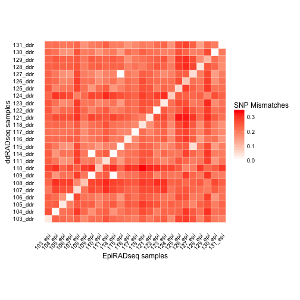

```r
##############################################################################
## Next we read in a text file derived from the "Base Counts"
## .vcf output from ipyrad. Base counts are used for analysis of 
## EpiRADseq data.

#Read in data file. The file "data3-2.txt" was generated from the notebook "VCF_readcounts.ipynb"
Epidata <- read.delim("data3-2.txt", header=FALSE)
#Since the base counts were split into four columns for each base, these need 
#to be summed
Epidata2 <- t(sapply(seq(4,ncol(Epidata), by=4), function(i) {
  indx <- i:(i+3)
  rowSums(Epidata[indx[indx <= ncol(Epidata)]])}))

#The resulting file needs to be transposed and turned into a dataframe
Epidata3 <- as.data.frame(t(Epidata2))
#Add column with locus number (CHROM from .vcf file)
locus <- Epidata[,1]
row.names(Epidata3) <- locus
#Add header names
header <- read.delim("header_data3.txt", header=FALSE)
names <- as.vector(t(header))
colnames(Epidata3) <- names
#Select samples of interest (some have very low sample sizes)
Epidata4 <- Epidata3[,c(3:20,24:33,35:56)]

#Remove ddr rows that have any zeros. The premise here is that zeros 
#in the EpiRAD dataset are informative because they may reflect 
#methylation, but they could also relfect true absence of the locus
#in the library. Here the ddRAD library serves to standarize the EpiRAD
#library. Any zeros in the ddRAD libary are treated as absence of the
#locus, thereby leaving zeros in the EpiRAD library only where the 
#locus was counted in the ddRAD library.

Epidata5 <- Epidata4[apply(Epidata4[c(seq(1, 50, by = 2))],1,
                     function(z) !any(z<=10)),] #increased from z==0


#################################################################
# Now use edgeR package to standardize EpiRAD count data by library size

#read in the file for edgeR
counts <- DGEList(counts=Epidata5)
counts$samples
```

```
##         group lib.size norm.factors
## 103_ddr     1   411254            1
## 103_epi     1   368277            1
## 104_ddr     1   307000            1
## 104_epi     1   115373            1
## 105_ddr     1   608489            1
## 105_epi     1   249848            1
## 106_ddr     1   564488            1
## 106_epi     1   429368            1
## 107_ddr     1    64310            1
## 107_epi     1    50632            1
## 108_ddr     1   186890            1
## 108_epi     1   114820            1
## 109_ddr     1   181319            1
## 109_epi     1   118132            1
## 110_ddr     1   471251            1
## 110_epi     1   230335            1
## 111_ddr     1   376482            1
## 111_epi     1   352327            1
## 114_ddr     1   108736            1
## 114_epi     1   135584            1
## 115_ddr     1   195523            1
## 115_epi     1   215589            1
## 116_ddr     1   170836            1
## 116_epi     1   104142            1
## 117_ddr     1   243369            1
## 117_epi     1   178226            1
## 118_ddr     1   558897            1
## 118_epi     1   269466            1
## 121_ddr     1   283137            1
## 121_epi     1   228322            1
## 122_ddr     1   474335            1
## 122_epi     1   285211            1
## 123_ddr     1   386564            1
## 123_epi     1   165287            1
## 124_ddr     1   186061            1
## 124_epi     1   146663            1
## 125_ddr     1   184894            1
## 125_epi     1   265467            1
## 126_ddr     1   222104            1
## 126_epi     1   219826            1
## 127_ddr     1   366450            1
## 127_epi     1   584926            1
## 128_ddr     1   353694            1
## 128_epi     1   233223            1
## 129_ddr     1   268912            1
## 129_epi     1   330763            1
## 130_ddr     1   273323            1
## 130_epi     1   192190            1
## 131_ddr     1   252362            1
## 131_epi     1   297413            1
```

```r
#TMM normalization (corrects for library size)
counts2 <- calcNormFactors(counts)
counts2$samples
```

```
##         group lib.size norm.factors
## 103_ddr     1   411254    0.9331087
## 103_epi     1   368277    1.1020241
## 104_ddr     1   307000    0.9614042
## 104_epi     1   115373    1.1227085
## 105_ddr     1   608489    0.9344246
## 105_epi     1   249848    1.1064124
## 106_ddr     1   564488    0.9057313
## 106_epi     1   429368    1.1064527
## 107_ddr     1    64310    0.9387256
## 107_epi     1    50632    1.1133242
## 108_ddr     1   186890    0.9251993
## 108_epi     1   114820    1.0814023
## 109_ddr     1   181319    0.9007711
## 109_epi     1   118132    1.1020525
## 110_ddr     1   471251    0.9287103
## 110_epi     1   230335    1.1022461
## 111_ddr     1   376482    0.9248727
## 111_epi     1   352327    1.0871394
## 114_ddr     1   108736    0.9113329
## 114_epi     1   135584    1.1206588
## 115_ddr     1   195523    0.8873901
## 115_epi     1   215589    1.1100679
## 116_ddr     1   170836    0.8648593
## 116_epi     1   104142    1.0031083
## 117_ddr     1   243369    0.9130984
## 117_epi     1   178226    1.0855159
## 118_ddr     1   558897    0.9245375
## 118_epi     1   269466    1.0641612
## 121_ddr     1   283137    0.9053579
## 121_epi     1   228322    1.0496501
## 122_ddr     1   474335    0.9377433
## 122_epi     1   285211    1.0965725
## 123_ddr     1   386564    0.9073029
## 123_epi     1   165287    1.0842226
## 124_ddr     1   186061    0.9211635
## 124_epi     1   146663    1.0911060
## 125_ddr     1   184894    0.9083563
## 125_epi     1   265467    1.1190389
## 126_ddr     1   222104    0.8763117
## 126_epi     1   219826    1.1291995
## 127_ddr     1   366450    0.8974457
## 127_epi     1   584926    1.1031081
## 128_ddr     1   353694    0.8864402
## 128_epi     1   233223    1.1008290
## 129_ddr     1   268912    0.8859438
## 129_epi     1   330763    1.1200127
## 130_ddr     1   273323    0.9133991
## 130_epi     1   192190    1.0938135
## 131_ddr     1   252362    0.9323836
## 131_epi     1   297413    1.1019866
```

```r
#extract normalized counts
counts2_cpm <- cpm(counts2, normalized.lib.sizes=TRUE, log=TRUE)

##Plots to show ddRAD vs EpiRAD library (before normalization)
par(mfrow = c(5, 5))
par(mar = c(2, 2 ,2 ,2), oma = c(4, 4, 0.5, 0.5))

for (i in seq(1,49, by = 2)){
  plot(Epidata5[,i], Epidata5[,i+1], main = colnames(Epidata5[i]), col = "blue")
}
```

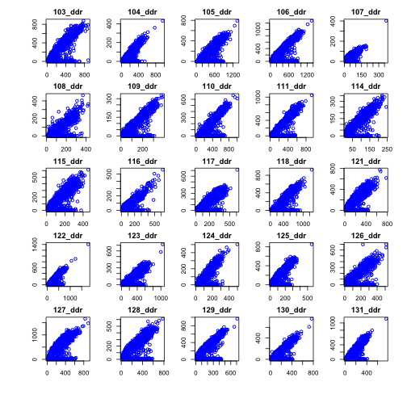

```r
#plot normalized counts
par(mfrow = c(5, 5))
par(mar = c(2, 2, 2, 2), oma = c(4, 4, 0.5, 0.5)) 

for (i in seq(1,49, by = 2)){
  plot(counts2_cpm[,i], counts2_cpm[,i+1], main = colnames(counts2_cpm[i]), col = "blue")
}
```

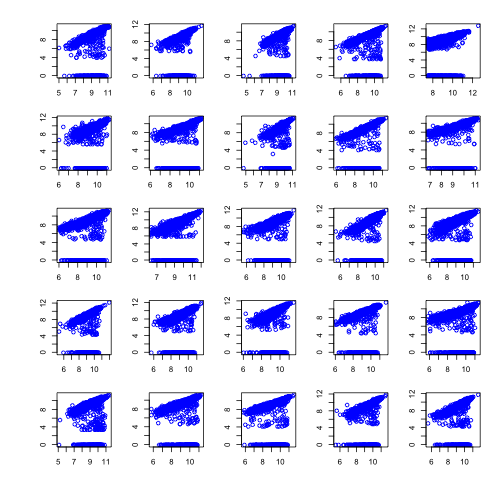

```r
##################################################################
#Using lm to get residuals

models <- list()
for (i in seq(1,49, by = 2)){
  models[[colnames(counts2_cpm)[i]]] <- lm(counts2_cpm[,i+1] ~ counts2_cpm[,i])
}

residuals <- lapply(models, '[[', 2)
resid_all <- as.data.frame(residuals)  

#plot residuals
par(mfrow = c(5, 5))
par(mar = c(2,2, 2, 2), oma = c(4, 4, 0.5, 0.5)) 

for (i in 1:25){
  plot(resid_all[,i], col = "blue", ylim = c(-10, 4))
  abline(h = -1)
}
```


```r
#Plot to compare raw data to residuals for representative sample
par(mfrow = c(3, 1))
par(mar = c(4, 4.5, 2, 1), oma = c(1, 1, 0, 0))
plot(Epidata5[,13], Epidata5[,14], xlab = "ddRAD read counts", ylab = "EpiRAD read counts", 
     col = "blue", cex.axis = 1.1, cex.lab = 1.2, yaxp = c(0, 300, 3))
plot(counts2_cpm[,13], counts2_cpm[,14], xlab = "ddRAD read counts", ylab = "EpiRAD read counts", 
     col = "blue", cex.axis = 1.1, cex.lab = 1.2)
abline(models$`109_ddr`)
plot(resid_all[,7], ylab = "Residual", col = "blue", cex.axis = 1.1, cex.lab = 1.2)
abline(h = -1, lty = "dotted")
mtext('A', side=3, line=-1.6, at = 0.15, outer=TRUE)
mtext('B', side=3, line=-20, at = 0.15, outer=TRUE)
mtext('C', side=3, line=-39, at = 0.15, outer=TRUE)
```

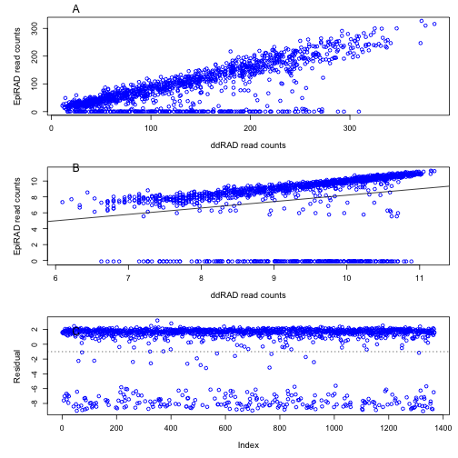

```r
#################################################################
#Make binary dataset of EpiRAD data based on residuals <=-1
#All methylated loci converted to 1, nonmethylated to zero

resid_all_binary <- ifelse(resid_all<=-1, 1, 0)

#proportion of methylated cutsites
prop_methyl <- colSums(resid_all_binary) / nrow(resid_all_binary)
dens <- density(prop_methyl)
par(mfrow = c(1, 1))
par(mar = c(5, 4, 4, 2))
plot(dens, xlab = "Methylation", ylab = "Density", main = "")
```

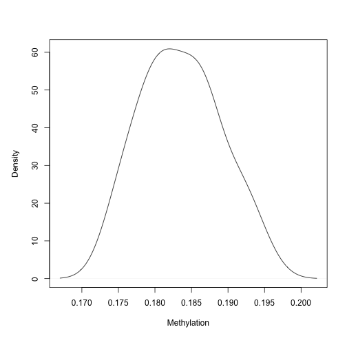

```r
mean(prop_methyl)
```

```
## [1] 0.1835673
```

```r
sd(prop_methyl)
```

```
## [1] 0.005443003
```

```r
#Get only rows that are differentially methylated
resid1 <- resid_all_binary[rowSums(resid_all_binary) < 25, ]
resid2 <- resid1[rowSums(resid1) >= 1, ]


########################################################
#Read in sample info (sample #, depth, symbiont type, habitat, diameter)

sinfo <- read.table("sample_info.txt", colClasses = 'character', header = TRUE)
#transpose
tsinfo <- t(sinfo)
#create vector for diameter (note whether sample 101
#was included or not)
diam <- as.numeric(tsinfo[5,])

###########################################################################
#MDS of ddRAD - SNP data

SNPs <- t(geno5)
# euclidean distances between the rows
ddist <- dist(SNPs) 
ddfit <- cmdscale(ddist,eig=TRUE, k=2)
ddx <- ddfit$points[,1]
ddy <- ddfit$points[,2]
plot(ddx, ddy, xlab="Coordinate 1", ylab="Coordinate 2", col = "blue")
```

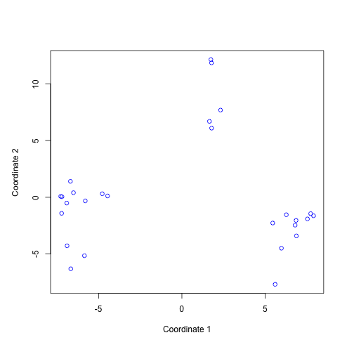

```r
####################################################################
#DAPC (discriminant analysis of principal components) of SNPs using adegenet

#Read in unlinked SNP file created at the top of this script.
#Note: must manually delete 1st entry in 1st row of "data3-2.str"
genind1 <- read.structure("data3-2.str", n.ind = 27, n.loc = 1113, 
                          onerowperind = FALSE, col.lab = 1, 
                          NA.char = "-9", ask = FALSE, 
                          row.marknames = 1, quiet = FALSE)
```

```
## 
##  Converting data from a STRUCTURE .stru file to a genind object...
```

```r
#Find optimal number of clusters irrespective of species id
#In this case, best to retain all PCs
groups <- find.clusters(genind1, max.n.clust=10, n.pca = 24,
                        choose.n.clust = FALSE, criterion = "min")


#Cross validation to determine number of PCs to retain
#xval <- xvalDapc(genind1@tab, groups$grp, n.pca.max = 25, training.set = 0.9,
                 #result = "groupMean", center = TRUE, scale = FALSE,
                 #n.pca = NULL, n.rep = 100, xval.plot = TRUE)
  
#show max number of PCs to retain
#xval[2:6]

#perform dapc using groups defined above group (groups$grp). Note 
#that n.pca and n.da can be left blank and the program will query 
#which values to choose.
dapc1 <- dapc(genind1, pop = groups$grp, n.pca=9, n.da = 2)
scatter(dapc1, posi.da = "bottomleft", scree.pca = TRUE, posi.pca = "bottomright")
```

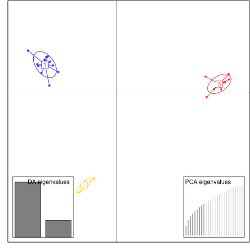

```r
#Plot cluster vs. BIC and DAPC together
par(mfrow = c(2, 1))
par(mar = c(6, 4.5, 2, 2), oma = c(1, 1, 1, 1))
plot(groups$Kstat, xlab = "Groups (K)", ylab = "BIC", pch = 16, 
     xaxp = c(1, 9, 4))
lines(groups$Kstat)
cols <- c("red", "orange", "purple")
scatter(dapc1, #label.inds = list(air = 0.1, pch = 0.5),
        posi.da = "bottomleft", scree.pca = TRUE, posi.pca = "bottomright",
        cell=0, cstar=0, clab=0, cex=3, solid=.4, bg="white", 
        leg=TRUE, posi.leg="topleft", col = cols)
```


```r
#look at loadings of individual loci (with labels for 90th percentile)
set.seed(4)
par(mfrow = c(1, 1))
par(mar = c(5, 4, 4, 2))
contrib <- loadingplot(dapc1$var.contr, axis=1, 
                       threshold= quantile(dapc1$var.contr,0.90), lab.jitter=1)
```

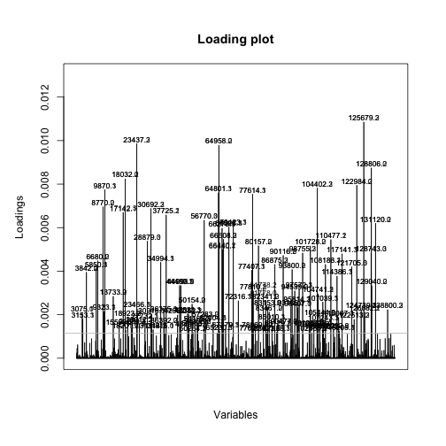

```r
###########################################################
#Fst for populations based on find.clusters

pop(genind1) <- groups$grp
genind1_df <- genind2hierfstat(genind1,pop=NULL)

#pairwise Weir and Cockeram's Fst
pairwise.WCfst(genind1_df,diploid=TRUE)
```

```
##           3         1         2
## 3        NA 0.1942800 0.2069206
## 1 0.1942800        NA 0.1907835
## 2 0.2069206 0.1907835        NA
```

```r
####################################################################
#DAPC (discriminant analysis of principal components) of Epi-loci using adegenet

#This uses the binary methylation file generated above (must be transposed)
resid_t_binary <- t(resid_all_binary)

#Find optimal number of clusters irrespective of species id
#In this case, best to retain all PCs
Epigroups <- find.clusters(resid_t_binary, max.n.clust=10, n.pca = 24,
                           choose.n.clust = FALSE, criterion = "min")
#Only one group found
plot(Epigroups$Kstat, xlab = "Groups (K)", ylab = "BIC", pch = 16, 
     xaxp = c(1, 9, 4))
```

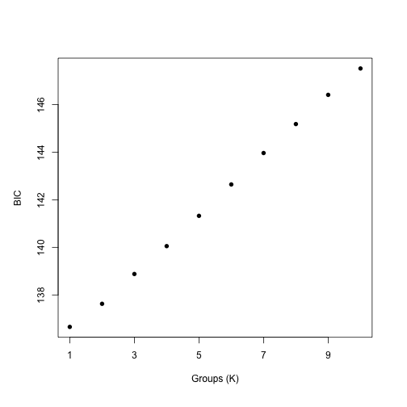

```r
###########################################################
#boxplot comparing branch diameter among groups from SNP dapc

diam2 <- as.numeric(sinfo[,5])
boxplot(diam2 ~ dapc1$assign, xlab = "Group", ylab =  "Diameter (mm)")
text(1.376804, 22.84152, "a", cex = 1)
text(1.990675, 13.63027, "b", cex = 1)
text(2.985303, 20.00729, "b", cex = 1)
```

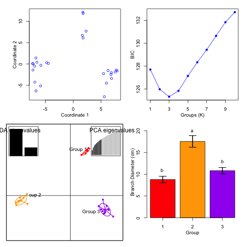

```r
#ANOVA
#Run lm on diameter by group
model <- lm(diam2 ~ dapc1$assign)
#Check model (qq plot, etc)
par(mfrow=c(2,2))
plot(model)
```

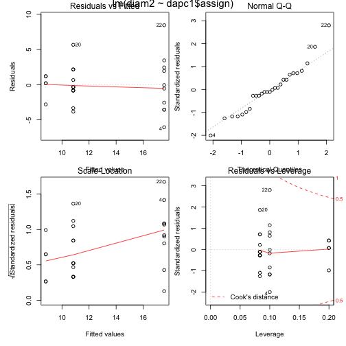

```r
#Breush Pagan Test for heteroscadisticity
bpt <- bptest(model)
print(bpt)
```

```
## 
## 	studentized Breusch-Pagan test
## 
## data:  model
## BP = 3.724, df = 2, p-value = 0.1554
```

```r
#Run ANOVA
aov <- anova(model)
print(summary(aov))
```

```
##        Df           Sum Sq         Mean Sq          F value     
##  Min.   : 2.0   Min.   :242.7   Min.   : 10.11   Min.   :17.38  
##  1st Qu.: 7.5   1st Qu.:269.9   1st Qu.: 51.52   1st Qu.:17.38  
##  Median :13.0   Median :297.1   Median : 92.92   Median :17.38  
##  Mean   :13.0   Mean   :297.1   Mean   : 92.92   Mean   :17.38  
##  3rd Qu.:18.5   3rd Qu.:324.3   3rd Qu.:134.33   3rd Qu.:17.38  
##  Max.   :24.0   Max.   :351.5   Max.   :175.74   Max.   :17.38  
##                                                  NA's   :1      
##      Pr(>F)        
##  Min.   :2.16e-05  
##  1st Qu.:2.16e-05  
##  Median :2.16e-05  
##  Mean   :2.16e-05  
##  3rd Qu.:2.16e-05  
##  Max.   :2.16e-05  
##  NA's   :1
```

```r
#pairwise t test with bonferonni adjustment
ttest <- pairwise.t.test(diam2, dapc1$assign, p.adj = "bonf")
print(ttest)
```

```
## 
## 	Pairwise comparisons using t tests with pooled SD 
## 
## data:  diam2 and dapc1$assign 
## 
##   1       2      
## 2 0.72411 -      
## 3 0.00015 0.00012
## 
## P value adjustment method: bonferroni
```

```r
######################################################################
#Multiple regression: test linear model of depth, symbiont type, and
#branch diameter vs. dapc of SNPs using a single DA from the model above

#use DA one from DAPC as SNP variable
scatter(dapc1,1,1)
 
#convert DF coord to vector
dapc1_da1 <- dapc1$ind.coord[,1]

#fit model with water depth (sinfo$V2), branch diameter (sinfo$V5), 
# habitat(sinfo$V4), and symbiont type (sinfo$V5) 
fit <- lm(na.omit(dapc1_da1 ~ as.numeric(sinfo$depth) + as.factor(sinfo$sym) + 
                    as.factor(sinfo$habitat) +as.numeric(sinfo$diam)))

#Relative importance of different variables in model
relimp <- calc.relimp(fit,type=c("lmg","last","first"),rela=TRUE)
print(relimp)
```

```
## Response variable: dapc1_da1 
## Total response variance: 110.9374 
## Analysis based on 25 observations 
## 
## 10 Regressors: 
## Some regressors combined in groups: 
##         Group  as.factor(sinfo$habitat) : `as.factor(sinfo$habitat)`2 `as.factor(sinfo$habitat)`3 `as.factor(sinfo$habitat)`4 `as.factor(sinfo$habitat)`5 `as.factor(sinfo$habitat)`6 `as.factor(sinfo$habitat)`7 `as.factor(sinfo$habitat)`8 
## 
##  Relative importance of 4 (groups of) regressors assessed: 
##  as.factor(sinfo$habitat) as.numeric(sinfo$depth) as.factor(sinfo$sym) as.numeric(sinfo$diam) 
##  
## Proportion of variance explained by model: 60.84%
## Metrics are normalized to sum to 100% (rela=TRUE). 
## 
## Relative importance metrics: 
## 
##                                  lmg        last       first
## as.factor(sinfo$habitat) 0.308485859 0.206337197 0.355480615
## as.numeric(sinfo$depth)  0.005179791 0.009213342 0.004962701
## as.factor(sinfo$sym)     0.020672135 0.012519339 0.033131408
## as.numeric(sinfo$diam)   0.665662215 0.771930123 0.606425277
## 
## Average coefficients for different model sizes: 
## 
##                                  1group     2groups     3groups
## as.numeric(sinfo$depth)       0.1059763  -0.2192037  -0.5361619
## as.factor(sinfo$sym)          4.7361700   2.9925421   0.3320024
## `as.factor(sinfo$habitat)`2  -9.8168954  -6.0763801  -1.8965982
## `as.factor(sinfo$habitat)`3   4.4048603   4.9549686   5.5022164
## `as.factor(sinfo$habitat)`4  -4.7681044  -2.6858987  -0.1307754
## `as.factor(sinfo$habitat)`5  -2.9915632  -5.2091085  -8.1716998
## `as.factor(sinfo$habitat)`6 -14.6586726 -12.1519505  -9.9519514
## `as.factor(sinfo$habitat)`7  -4.2767722  -5.4225703  -7.6044642
## `as.factor(sinfo$habitat)`8 -16.1482689 -14.9336251 -15.5970576
## as.numeric(sinfo$diam)        1.5444239   1.5384085   1.5572994
##                                 4groups
## as.numeric(sinfo$depth)      -0.7157231
## as.factor(sinfo$sym)         -3.2466230
## `as.factor(sinfo$habitat)`2   1.5769340
## `as.factor(sinfo$habitat)`3   6.1098235
## `as.factor(sinfo$habitat)`4   1.4752180
## `as.factor(sinfo$habitat)`5 -10.5955763
## `as.factor(sinfo$habitat)`6  -6.7619741
## `as.factor(sinfo$habitat)`7 -10.0246970
## `as.factor(sinfo$habitat)`8 -16.8693777
## as.numeric(sinfo$diam)        1.5930019
```

```r
###########################################################################
#MDS of EpiRAD data

resid_t_binary <- t(resid_all_binary)
# euclidean distances between the rows
epidist <- dist(resid_t_binary) 
epifit <- cmdscale(epidist,eig=TRUE, k=2)
epix <- epifit$points[,1]
epiy <- epifit$points[,2]
plot(epix, epiy, xlab="Coordinate 1", ylab="Coordinate 2", col = "blue")
 

############################################################################
#heatmap of EpiRAD data 

#transpose differentially expressed dataset
resid_t_diff <- t(resid2)

#color pallet matrix for SNP groups and branch diam groups (in between whitespace)
groupvec <- as.character(groups$grp)
SNP_Groups <- groupvec[c(2:10,12:27)]
SNP_Groups <- replace(SNP_Groups, which(SNP_Groups == 1), "#FE9EA3")
SNP_Groups <- replace(SNP_Groups, which(SNP_Groups == 2), "#FEDAA9")
SNP_Groups <- replace(SNP_Groups, which(SNP_Groups == 3), "#D8ACF7")
#col_pal = colorRampPalette(c('light gray', 'black'))(25+1)
#data_seq = seq(min(as.numeric(sinfo[c(2:10,12:27),]$diam)), max(as.numeric(sinfo[c(2:10,12:27),]$diam)), length=25)
#Diameter = col_pal[ cut(as.numeric(sinfo[c(2:10,12:27),]$diam), data_seq, include.lowest=T) ]
#white <- colorRampPalette(colors= "#ffffff")
#whitespace <- white(25)
#myCols = cbind(SNP_Groups, whitespace, Diameter)

#library("heatmap.plus")

#heatmap.plus(resid_t_diff, scale = "none", labRow = sinfo$sample, labCol = FALSE,
#        RowSideColors = myCols, col = c("#6baed6", "#08519c"))


#Matrix for heatmap
heat.mat <- cbind(diam[c(2:10,12:27)], resid_t_diff)
rownames(heat.mat) <- sinfo$sample[c(2:10,12:27)]

superheat(heat.mat[,2:209], left.label.size = 0.11, bottom.label.size = 0.1,
          scale = FALSE, row.dendrogram = FALSE, col.dendrogram = FALSE,
          pretty.order.rows = TRUE, pretty.order.cols = TRUE,
          heat.pal = c("#6baed6", "#08519c"), yr = heat.mat[,1], 
          legend = FALSE, grid.hline.col = "black",
          grid.hline.size = 0.1, yr.obs.col = rep("gray", 25),
          left.label.col = SNP_Groups, yr.axis.name = "Diameter (cm)",
          yr.plot.type = "bar")
 
############################################################################
#Determine if diff. methylated loci are associated with SNPs with high 
#loading scores in the DAPC

cont <- as.matrix(dapc1$var.contr[,1])
loci.names <- gsub("\\..*","",rownames(cont))
loci.1 <- cbind(loci.names, cont)
loci.2 <-  loci.1[!duplicated(loci.1[,1]),]

loci.Epi <- as.matrix(rownames(resid2))
loci.both <- as.matrix(merge(loci.2,loci.Epi, by.x = "loci.names", by.y = "V1"))
loci.Epi2 <- as.numeric(loci.both[,2])
loci.all <- as.numeric(loci.2[,2])

# Compare epi loci to random sample, plot density curves

random.loci <- sample(loci.all, 151, replace=FALSE)
random.loci.dens <- density(random.loci)
loci.epi.dens <- density(loci.Epi2)

par(mfrow = c(1, 1))
```

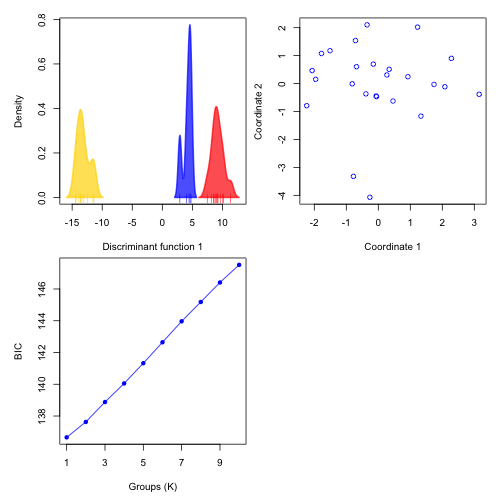

```r
par(mar = c(5, 4, 4, 2))
plot(random.loci.dens, col = "blue", xlab = "Contribution to DAPC axis 1", main = NA)
lines(loci.epi.dens, col = "red")
legend(0.001667958, 2882.674, legend = c("random sample of loci", "differentially methylated loci"), 
       col = c("blue", "red"), bty = "n", lty = 1)
```

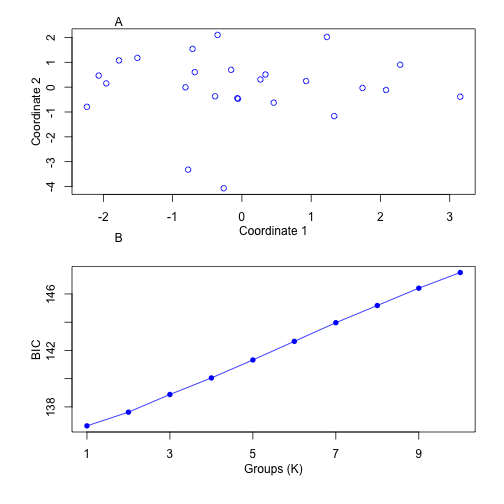

```r
#Compare distributions with Kolomogorov-Smirnov test

ks <- ks.test(random.loci, loci.Epi2)
```

```
## Warning in ks.test(random.loci, loci.Epi2): p-value will be approximate in
## the presence of ties
```

```r
ks$p.value
```

```
## [1] 0.5350434
```

```r
############################################################
#Compare pairwise genetic distance with pairwise epigenetic distance

snpdist <- t(geno7[,c(seq(1,50, by = 2))])

snpdist2 <- dist.gene(snpdist, method = "percent", pairwise.deletion = FALSE,
                        variance = FALSE)
snpdist3 <- as.matrix(snpdist2)

# Get lower triangle of the  matrix
get_lower_tri<-function(snpdist3){
  snpdist3[upper.tri(snpdist3)] <- NA
  return(snpdist3)
}
# Get upper triangle of the  matrix
get_upper_tri <- function(snpdist3){
  snpdist3[lower.tri(snpdist3)]<- NA
  return(snpdist3)
}

upper_tri <- get_upper_tri(snpdist3)
snpdist4 <- melt(upper_tri, na.rm = TRUE)
snpdist5 <- snpdist4[!(snpdist4$value == 0) >= 1,]

#Now do the same thing for methylation data

resid_diff <- t(resid_t_diff)
colnames(resid_diff) <- colnames(Epidata5[,c(seq(1,50, by = 2))])
methdist <- t(resid_diff)
methdist2 <- dist.gene(methdist, method = "percent", pairwise.deletion = FALSE,
                        variance = FALSE)
methdist3 <- as.matrix(methdist2)

# Get lower triangle of the  matrix
get_lower_tri<-function(methdist3){
  methdist3[upper.tri(methdist3)] <- NA
  return(methdist3)
}
# Get upper triangle of the  matrix
get_upper_tri <- function(methdist3){
  methdist3[lower.tri(methdist3)]<- NA
  return(methdist3)
}

upper_tri <- get_upper_tri(methdist3)
methdist4 <- melt(upper_tri, na.rm = TRUE)
methdist5 <- methdist4[!(methdist4$value == 0) >= 1,]
epi_snp_lm <- lm(snpdist5[,3] ~ methdist5[,3])

plot(snpdist5[,3], methdist5[,3], ylim = c(0, 0.35), col = "blue", 
     xlab = "Genetic distance", ylab = "Epigenetic distance")
abline(epi_snp_lm)
```

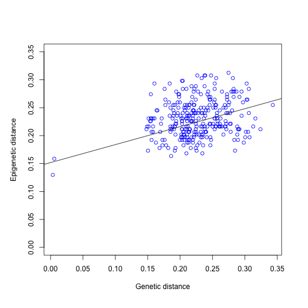

